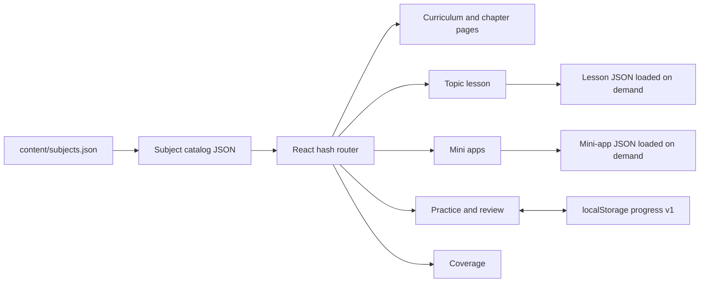
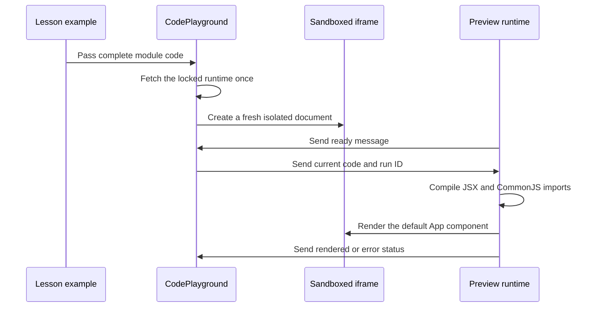

# Simple Learning project journal

This is the append-only technical history of Simple Learning. Read the newest entry before pushing to Git. Read `PROJECT-HANDOFF.md` when continuing work in a new task.

## Permanent journal rules

1. Add one dated entry after every meaningful work session or milestone.
2. Never delete or rewrite an older entry. If an old statement becomes wrong, explain the correction in a new entry.
3. Describe the final behavior, architecture changes, data flow changes, packages, important files, solved issues, checks, limitations, alternatives, and the next safe starting point.
4. Record only checks that actually ran. Keep unfinished checks explicit.
5. Keep product content and UI text in simple English. This journal also uses clear English so it can be reviewed without the original task history.
6. Do not claim that a planned lesson is available, that a mapped source is fully covered, or that a learner has mastered a topic without evidence.

## Entry template for future work

Copy these headings below the latest entry and fill them with facts from the completed work:

```text
## YYYY-MM-DD — Short milestone name

### Goal and result
### Current product status
### Decisions made
### Architecture and flow changes
### Packages and tools
### Files changed
### Problems found and how they were solved
### Alternatives and later improvements
### Verification completed
### Remaining risks and next starting point
```

---

## 2026-09-11 — Recovered product plan and content foundation

### Goal and result

The React learning idea was recovered from the earlier “Clarify Bengali plan” task and moved into the dedicated Simple Learning repository. The recovered decisions were saved so later work does not depend on another task's history.

The product starts with React and may support more subjects later. The app must use simple English, keep the interface minimal, and prioritize correct content and learning practice. Its learning hierarchy is subject → chapter → topic.

### Content foundation recovered

- 30 ordered React chapters.
- 324 planned syllabus topics.
- 117 mappings from official-source areas to syllabus topics.
- One authored `useState` sample lesson with 11 examples, 10 exercises, and 12 original interview-style questions.
- One six-step quantity-picker mini app with concept links and two independent build ideas.
- Explicit coverage gaps and pending audits. A source mapping records a destination; it does not mean the lesson is complete.

### Product decisions preserved

- Every complete topic needs prerequisites; what, why, and how; useful syntax variations; real scenarios; examples; common mistakes; 5–10 exercises; optional hints; explained modal solutions; interview preparation; mini-app links; spaced review; and mastery evidence.
- A learner must save an attempt before viewing a solution. Viewing hints or solutions records assistance and never grants mastery.
- Interview questions are original interview-style material unless a public record provides a URL, date, and honest attribution. Company provenance must never be invented.
- JSON is the first content store. Database storage, authentication, AI, larger projects, and a dedicated bug-fixing area are later work.
- The eventual direction is a complete MERN LMS, but current work stays focused on content coverage and the learning experience.

### Records created

- `docs/PROJECT-HANDOFF.md` contains the current decisions, implementation status, commands, checks, and pending work.
- Generated review documents expose the syllabus, `useState` lesson, mini app, and coverage inventory in readable Markdown.

---

## 2026-09-11 — Standalone minimal React learning application

### Goal and result

Simple Learning became an independent React application. It no longer depends on scripts, packages, servers, or files from the location where the idea was first discussed. No REAle ERP file was used or modified.

The UI clearly separates one available sample lesson from 323 planned topics. Learners can browse the syllabus, open the `useState` lesson, practise, review their work, inspect the mini app, and inspect official-source coverage.

### Architecture

The application has four main layers:

1. **Authored content** — JSON under `content/` is the source of truth.
2. **Content delivery** — Vite serves JSON during development and copies the same paths into the production build.
3. **React UI** — hash routes select the subject, chapter, topic, lesson section, mini app, review page, or coverage page.
4. **Learner records** — attempts and evidence stay separate from authored JSON in versioned browser storage.



### Main navigation and content flow

1. `src/main.jsx` mounts the application and imports the global styles.
2. `src/App.jsx` reads the URL hash, loads `content/subjects.json`, selects a subject, and loads its catalog and sources.
3. `src/content.js` creates safe hash links, parses routes, validates catalog basics, and restricts JSON requests to safe `content/...json` paths.
4. `src/useContent.js` performs cancellable JSON requests and returns loading, data, error, and retry state.
5. `src/App.jsx` sends the selected route to curriculum, chapter, topic, mini-app, review, or coverage components.
6. A topic with `lessonPath` loads its lesson. A topic without one shows “This lesson is planned” and never pretends content exists.

### Learning and progress flow

1. `src/Lesson.jsx` renders Learn, Examples, Practice, Mastery check, and Interview sections from lesson JSON.
2. A learner writes an answer and reasoning before saving an exercise attempt.
3. `src/progress.js` creates an immutable attempt snapshot. Later editing does not change the saved attempt.
4. Hints and solution reveals are stored as assistance. Later attempts remain assisted for that exercise.
5. The learner compares the saved work with explained feedback and records a self-review outcome.
6. The first saved attempt starts the delayed review schedule.
7. `src/Review.jsx` collects fresh answers after a gap and stores self-review results. It never awards automatic mastery.
8. `src/ProgressContext.jsx` owns browser persistence and protects unreadable existing data from being overwritten.

### Folder and file responsibilities

| Path | Responsibility |
| --- | --- |
| `content/subjects.json` | Subject registry. New subjects enter the app here. |
| `content/react/curriculum.json` | Ordered React chapters and topics, prerequisites, statuses, and links to lessons or mini apps. |
| `content/react/lessons/` | Authored topic lesson JSON. Currently contains `use-state.json`. |
| `content/react/mini-apps/` | Step-by-step mini-app content and final code. |
| `content/react/ideas.json` | Independent build ideas connected to learned concepts. |
| `content/react/sources.json` | Official source URLs, versions, and recorded review dates. |
| `content/react/coverage.json` | Source-to-topic mappings, exclusions, update policy, and unresolved audits. |
| `src/App.jsx` | Application shell, route selection, subject loading, curriculum, chapters, and planned-topic state. |
| `src/Lesson.jsx` | Lesson navigation and all lesson learning sections. |
| `src/MiniApps.jsx` | Mini-app list, step reader, concept links, related ideas, and interactive quantity demo. |
| `src/Review.jsx` | Mastery evidence and spaced-review UI. |
| `src/Coverage.jsx` | Coverage totals, missing audits, mappings, and source registry. |
| `src/components.jsx` | Shared badges, source links, modal, code block, loading, error, and missing-content components. |
| `src/content.js` | Route helpers, safe content fetching, and basic catalog validation. |
| `src/useContent.js` | Reusable JSON loading and retry hook with request cancellation. |
| `src/progress.js` | Pure progress rules, immutable attempts, assistance rules, review dates, and storage validation. |
| `src/ProgressContext.jsx` | React access to progress state and `localStorage`. |
| `src/styles.css` | Minimal responsive presentation and visible interaction states. |
| `scripts/validate-content.mjs` | Relationship, content, source, code, and initial-render checks. |
| `scripts/render-docs.mjs` | Generates human-readable review documents from JSON. |
| `tests/` | Focused tests for routes, content status, progress integrity, assistance, recovery, and review scheduling. |
| `vite.config.js` | React build plus the plugin that copies authored JSON to matching production paths. |

### Packages and why they exist

| Package | Type | Purpose |
| --- | --- | --- |
| `react` 19.3.0 | Runtime | Components, state, effects, context, and error boundaries. |
| `react-dom` 19.3.0 | Runtime | Mounts the app and renders complete examples during validation. |
| `vite` 8.3.0 | Development | Development server and production bundling. |
| `@vitejs/plugin-react` 6.1.1 | Development | JSX and React integration for Vite. |
| `@babel/parser` 8.0.5 | Development | Parses authored JavaScript and JSX snippets during validation. |
| `esbuild` 0.28.2 | Development | Converts complete JSX examples for server-render validation. |

The supported Node range is `^22.18.0 || >=24.11.0`. The lockfile belongs to this repository and should be preserved. Use `npm ci` for a clean installation.

### Problems solved

- The recovered directory initially lacked a standalone frontend setup. Its own manifest, lockfile, Vite configuration, entry page, React source, tests, and scripts were added.
- Authored JSON previously risked needing a second public copy. The Vite content plugin now serves one source in development and emits the same JSON paths into `dist/content/`.
- Planned topics could be confused with complete lessons. Catalog status and `lessonPath` now control distinct UI states.
- Reading content could have been mistaken for mastery. Attempts, help history, self-review, transfer evidence, and delayed review are separate signals.
- Corrupt browser storage could have been overwritten. The app enters a session-only recovery state and preserves the unreadable stored value.

### Verification completed

- The standalone development URL returned successfully.
- The production build contained the authored JSON at the expected paths.
- The quantity picker was checked in Chrome from quantity 1 through both limits, including total changes, disabled controls, reset, and keyboard activation.
- Automated tests covered subject discovery, planned and authored status, route parsing, immutable attempts, assistance rules, storage recovery, retry drafts, and delayed dates.

### Alternatives and later improvements

- React Router could replace the small hash router when nested application needs become larger. The current router keeps dependencies and hosting requirements small.
- IndexedDB or a backend could replace `localStorage` when accounts and synchronization arrive. The authored lesson format should remain separate from learner records.
- Automated browser tests can later cover modals, focus, responsive behavior, progress persistence, and error screens. Current pure tests do not replace those checks.

---

## 2026-09-11 — Shared lesson contract, JSON-owned review, and live React preview

### Goal and result

The first reusable lesson-authoring contract and an editable React preview were added. The `useState` sample remains a sample draft because independent content review, a learner trial, and full browser checks are still pending.

Every complete module example can now open a small playground. A learner writes a prediction, edits `App.jsx`, runs it in isolation, compares the result, sees compile or render feedback, and resets to the authored example.

### Architecture and flow changes

#### Topic authoring flow

1. A topic is first planned in `content/react/curriculum.json`.
2. Sources and coverage destinations are registered before writing claims.
3. The lesson is written against `schema/topic-lesson.schema.json` and the human checklist in `docs/TOPIC-AUTHORING.md`.
4. `npm run validate:content` validates every JSON file under `content/react/lessons/`.
5. A lesson stays `sample-draft` while any publication check is pending. A published lesson fails validation if a check is false.
6. Generated Markdown is refreshed with `npm run docs:generate` for human review.

#### Live preview flow



`src/CodePlayground.jsx` owns the editor, prediction, Run, Reset, status, and iframe lifecycle. It fetches the generated runtime once and embeds it in a sandboxed `srcdoc` page. Every run changes the iframe key, which resets timers, React state, and old output.

`src/preview/runner.jsx` uses Babel in the iframe, provides only the lesson's `react` and `react/jsx-runtime` imports, requires a default React component, renders through a React error boundary, and returns a short error message to the parent.

The iframe uses `sandbox="allow-scripts"` without same-origin access. Its content policy blocks connections and external assets. It cannot access the parent app or its browser storage. The editor is a focused lesson tool: it does not install extra packages, run backend code, grade practice submissions, or save editor changes.

#### Review flow change

Delayed review content is no longer generated by useState-specific application code. Each lesson JSON now owns `mastery.reviewSchedule.sessions`, and every session contains its day offset, fresh problems, and explained feedback. `src/Review.jsx` is therefore reusable for later topics and subjects.

### New packages and configuration

| Package | Purpose |
| --- | --- |
| `@babel/standalone` 8.0.5 | Compiles editable JSX inside the isolated browser preview. |
| `ajv` 8.20.0 | Validates every authored lesson against the shared JSON Schema. |

`vite.preview.config.js` creates the self-contained IIFE runtime at `public/preview-runtime.js`. That generated file is ignored by Git because `npm run preview:runtime`, `npm run dev`, and `npm run build` reproduce it from locked dependencies. The normal Vite build copies it into `dist/`.

The preview configuration replaces `process.env.NODE_ENV` with `"production"`. React's bundled runtime otherwise referenced an undefined browser `process` global.

### Main files changed

| File | Change |
| --- | --- |
| `src/CodePlayground.jsx` | Added prediction, editor, run/reset controls, sandbox creation, runtime caching, and parent/iframe messages. |
| `src/preview/runner.jsx` | Added JSX compilation, restricted React imports, rendering, error boundary, and status messages. |
| `src/Lesson.jsx` | Opens the playground for each complete module example. |
| `src/styles.css` | Added responsive editor/preview layout and playground states. |
| `vite.preview.config.js` | Added the separate preview-runtime build and production environment replacement. |
| `package.json` and `package-lock.json` | Added exact Babel standalone and AJV dependencies plus preview build scripts. |
| `.gitignore` | Ignores the reproducible generated preview runtime. |
| `schema/topic-lesson.schema.json` | Defines required lesson content, exercises, mastery, review sessions, provenance, and publication checks. |
| `scripts/validate-content.mjs` | Validates every lesson, publication status, IDs, source links, JSX, server renders, and interview provenance. |
| `content/react/lessons/use-state.json` | Moved all four delayed-review sessions and their explained problems into authored content. |
| `src/Review.jsx` and `src/progress.js` | Read topic-owned review sessions and removed the hardcoded useState review generator. |
| `scripts/render-docs.mjs` | Generates review dates, questions, and feedback from the new session structure. |
| `docs/TOPIC-AUTHORING.md` | Records the repeatable research, writing, practice, review, and publication standard. |

### Problems found and how they were solved

1. **The first iframe stayed on “Running your code…”** — the ready message could arrive before the parent completed its listener update. The iframe now also sends the current code from its load handler.
2. **An external runtime did not execute safely inside the opaque sandbox** — the parent now fetches the locked local runtime once and places it inside the sandboxed `srcdoc` document. This keeps the iframe isolated without granting same-origin access.
3. **The preview runtime crashed with `process is not defined`** — the separate Vite build now replaces `process.env.NODE_ENV` at build time.
4. **Spaced-review questions were hardcoded for useState** — review problems moved into lesson JSON and the schema requires topic-owned sessions.
5. **Generated documentation still expected `dayOffsets`** — the renderer now reads session objects and includes their questions and feedback.
6. **Interview provenance could be stated without enough evidence** — validator rules now require recorded interview material to use the recorded type, a public URL, a source date, and an honest recorded flag. Original questions must have no company or interview URL.

### Verification completed

- `npm test`: 13 of 13 focused tests passed.
- `npm run validate:content`: 30 chapters, 324 topics, 117 mappings, 10 exercises, 12 interview questions, 19 parsed snippets, one schema-valid authored lesson, and 14 server-rendered modules passed.
- `npm run build`: preview runtime and production app built successfully. The generated preview runtime is about 2.42 MB before compression and about 632 KB compressed.
- `npm run docs:generate`: syllabus, `useState`, mini-app, and coverage documents generated successfully after the review-format migration.
- Chrome live-preview check: the counter rendered at 0, changed to 1 after a click, accepted edited code with initial value 10 and a different increment, showed a useful invalid-JSX message, and Reset restored the authored code and Count 0.
- `git diff --check` found no whitespace errors; Git only reported the repository's normal Windows line-ending notices.

### Current product status

- 30 chapters and 324 planned topics remain in the catalog.
- One `useState` lesson is available as `sample-draft`; 323 topics remain planned and no lesson is published.
- 117 source mappings exist. Remaining official-document audits stay explicit.
- The quantity-picker mini app is available.
- Browser practice remains local and self-assessed. There is no account, database, AI grading, or backend.

### Alternatives and later improvements

- A smaller JSX compiler could reduce the first playground load. Babel standalone was chosen because it handles the current lesson syntax reliably and keeps the first version self-contained.
- A dedicated preview origin or worker-based runner could provide another isolation boundary later. The current sandbox and content policy are appropriate for learner-authored browser examples, but the network policy still needs a direct browser probe before the full lesson check can be marked complete.
- A richer code editor can later add syntax highlighting and file tabs. The textarea keeps the first UI small and accessible.
- Review-session IDs or a future schedule version may help migrate learner records if authored review days change after release.

### Remaining risks and next starting point

- Manually review the full app, especially every lesson section, modal focus, saved attempts, delayed reviews, responsive layout, zoom, retry states, and all 11 live examples.
- Probe the preview network policy in a browser before marking `browserBehaviorChecked` true.
- Complete an independent content review and a learner trial before publishing `useState`.
- The next content milestone should follow syllabus order and author the first planned prerequisite topic using the shared schema and authoring checklist.

---

## 2026-09-11 — Append-only progress documentation introduced

### Goal and result

An append-only project journal was added so every Git push can be reviewed with the implementation context that produced it. The first entries reconstruct the recovered plan, the standalone application milestone, and the live-preview and lesson-contract milestone.

### Documentation flow change

- `docs/PROJECT-JOURNAL.md` is the permanent chronological implementation history.
- `docs/PROJECT-HANDOFF.md` remains the current operational handoff for a future task.
- `README.md` links to both documents and states that every meaningful session must append a new journal entry.
- Generated documents such as `docs/USESTATE.md` remain review copies of JSON and are not used as the historical journal.

Future entries must preserve older records and explain status, decisions, architecture, data and UI flow, dependencies, file responsibilities, solved issues, alternatives, completed checks, limitations, and the next starting point. If an older decision changes, the new entry records the correction instead of editing history.

### Files changed

- Added `docs/PROJECT-JOURNAL.md` with permanent rules, a reusable entry template, and complete records for the current foundation.
- Updated `README.md` so the journal is the first review document and its maintenance rule is visible.
- Updated `docs/PROJECT-HANDOFF.md` so future tasks must maintain both the current handoff and the append-only journal.

### Verification completed

- The journal paths referenced by README and the handoff exist.
- Markdown whitespace validation passed.

### Next starting point

The user will manually review the application before more implementation. Record any findings in the next dated journal entry together with the fixes that follow.
