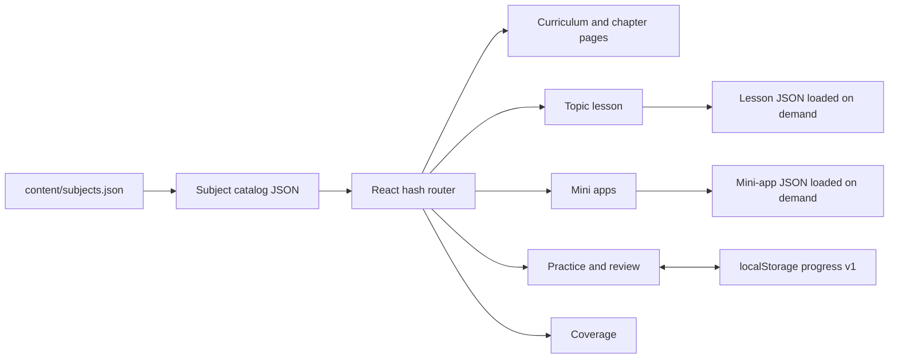
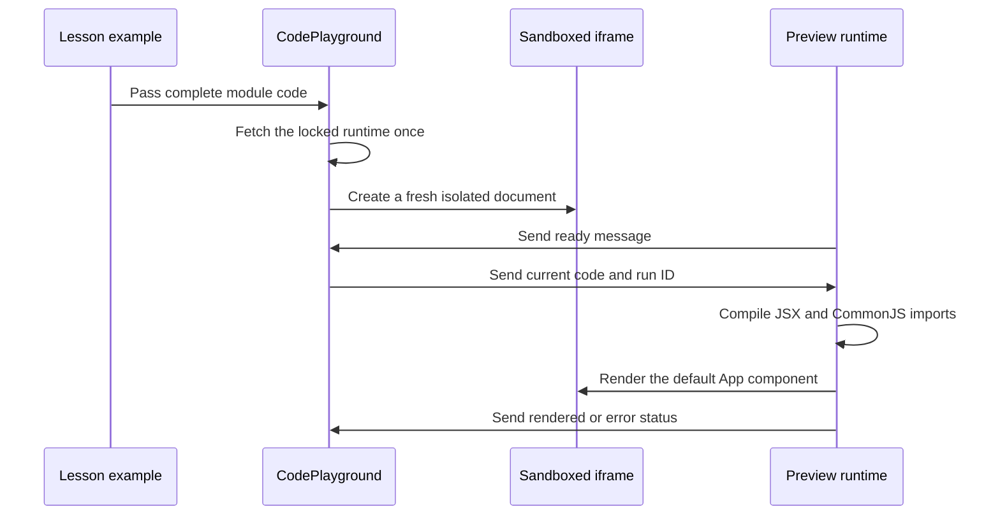

# Simple Learning project journal

This is the append-only technical history of Simple Learning. Read the newest entry before pushing to Git. Read `PROJECT-HANDOFF.md` when continuing work in a new task.

## Permanent journal rules

1. Add one dated entry after every meaningful work session or milestone.
2. Never delete or rewrite an older entry. If an old statement becomes wrong, explain the correction in a new entry.
3. Describe the final behavior, architecture changes, data flow changes, packages, important files, solved issues, checks, limitations, alternatives, and the next safe starting point.
4. Record only checks that actually ran. Keep unfinished checks explicit.
5. Keep product content and UI text in simple English. This journal also uses clear English so it can be reviewed without the original task history.
6. Do not claim that a planned lesson is available, that a mapped source is fully covered, or that a learner has mastered a topic without evidence.

## Entry template for future work

Copy these headings below the latest entry and fill them with facts from the completed work:

```text
## YYYY-MM-DD — Short milestone name

### Goal and result
### Current product status
### Decisions made
### Architecture and flow changes
### Packages and tools
### Files changed
### Problems found and how they were solved
### Alternatives and later improvements
### Verification completed
### Remaining risks and next starting point
```

---

## 2026-09-11 — Recovered product plan and content foundation

### Goal and result

The React learning idea was recovered from the earlier “Clarify Bengali plan” task and moved into the dedicated Simple Learning repository. The recovered decisions were saved so later work does not depend on another task's history.

The product starts with React and may support more subjects later. The app must use simple English, keep the interface minimal, and prioritize correct content and learning practice. Its learning hierarchy is subject → chapter → topic.

### Content foundation recovered

- 30 ordered React chapters.
- 324 planned syllabus topics.
- 117 mappings from official-source areas to syllabus topics.
- One authored `useState` sample lesson with 11 examples, 10 exercises, and 12 original interview-style questions.
- One six-step quantity-picker mini app with concept links and two independent build ideas.
- Explicit coverage gaps and pending audits. A source mapping records a destination; it does not mean the lesson is complete.

### Product decisions preserved

- Every complete topic needs prerequisites; what, why, and how; useful syntax variations; real scenarios; examples; common mistakes; 5–10 exercises; optional hints; explained modal solutions; interview preparation; mini-app links; spaced review; and mastery evidence.
- A learner must save an attempt before viewing a solution. Viewing hints or solutions records assistance and never grants mastery.
- Interview questions are original interview-style material unless a public record provides a URL, date, and honest attribution. Company provenance must never be invented.
- JSON is the first content store. Database storage, authentication, AI, larger projects, and a dedicated bug-fixing area are later work.
- The eventual direction is a complete MERN LMS, but current work stays focused on content coverage and the learning experience.

### Records created

- `docs/PROJECT-HANDOFF.md` contains the current decisions, implementation status, commands, checks, and pending work.
- Generated review documents expose the syllabus, `useState` lesson, mini app, and coverage inventory in readable Markdown.

---

## 2026-09-11 — Standalone minimal React learning application

### Goal and result

Simple Learning became an independent React application. It no longer depends on scripts, packages, servers, or files from the location where the idea was first discussed. No REAle ERP file was used or modified.

The UI clearly separates one available sample lesson from 323 planned topics. Learners can browse the syllabus, open the `useState` lesson, practise, review their work, inspect the mini app, and inspect official-source coverage.

### Architecture

The application has four main layers:

1. **Authored content** — JSON under `content/` is the source of truth.
2. **Content delivery** — Vite serves JSON during development and copies the same paths into the production build.
3. **React UI** — hash routes select the subject, chapter, topic, lesson section, mini app, review page, or coverage page.
4. **Learner records** — attempts and evidence stay separate from authored JSON in versioned browser storage.



### Main navigation and content flow

1. `src/main.jsx` mounts the application and imports the global styles.
2. `src/App.jsx` reads the URL hash, loads `content/subjects.json`, selects a subject, and loads its catalog and sources.
3. `src/content.js` creates safe hash links, parses routes, validates catalog basics, and restricts JSON requests to safe `content/...json` paths.
4. `src/useContent.js` performs cancellable JSON requests and returns loading, data, error, and retry state.
5. `src/App.jsx` sends the selected route to curriculum, chapter, topic, mini-app, review, or coverage components.
6. A topic with `lessonPath` loads its lesson. A topic without one shows “This lesson is planned” and never pretends content exists.

### Learning and progress flow

1. `src/Lesson.jsx` renders Learn, Examples, Practice, Mastery check, and Interview sections from lesson JSON.
2. A learner writes an answer and reasoning before saving an exercise attempt.
3. `src/progress.js` creates an immutable attempt snapshot. Later editing does not change the saved attempt.
4. Hints and solution reveals are stored as assistance. Later attempts remain assisted for that exercise.
5. The learner compares the saved work with explained feedback and records a self-review outcome.
6. The first saved attempt starts the delayed review schedule.
7. `src/Review.jsx` collects fresh answers after a gap and stores self-review results. It never awards automatic mastery.
8. `src/ProgressContext.jsx` owns browser persistence and protects unreadable existing data from being overwritten.

### Folder and file responsibilities

| Path | Responsibility |
| --- | --- |
| `content/subjects.json` | Subject registry. New subjects enter the app here. |
| `content/react/curriculum.json` | Ordered React chapters and topics, prerequisites, statuses, and links to lessons or mini apps. |
| `content/react/lessons/` | Authored topic lesson JSON. Currently contains `use-state.json`. |
| `content/react/mini-apps/` | Step-by-step mini-app content and final code. |
| `content/react/ideas.json` | Independent build ideas connected to learned concepts. |
| `content/react/sources.json` | Official source URLs, versions, and recorded review dates. |
| `content/react/coverage.json` | Source-to-topic mappings, exclusions, update policy, and unresolved audits. |
| `src/App.jsx` | Application shell, route selection, subject loading, curriculum, chapters, and planned-topic state. |
| `src/Lesson.jsx` | Lesson navigation and all lesson learning sections. |
| `src/MiniApps.jsx` | Mini-app list, step reader, concept links, related ideas, and interactive quantity demo. |
| `src/Review.jsx` | Mastery evidence and spaced-review UI. |
| `src/Coverage.jsx` | Coverage totals, missing audits, mappings, and source registry. |
| `src/components.jsx` | Shared badges, source links, modal, code block, loading, error, and missing-content components. |
| `src/content.js` | Route helpers, safe content fetching, and basic catalog validation. |
| `src/useContent.js` | Reusable JSON loading and retry hook with request cancellation. |
| `src/progress.js` | Pure progress rules, immutable attempts, assistance rules, review dates, and storage validation. |
| `src/ProgressContext.jsx` | React access to progress state and `localStorage`. |
| `src/styles.css` | Minimal responsive presentation and visible interaction states. |
| `scripts/validate-content.mjs` | Relationship, content, source, code, and initial-render checks. |
| `scripts/render-docs.mjs` | Generates human-readable review documents from JSON. |
| `tests/` | Focused tests for routes, content status, progress integrity, assistance, recovery, and review scheduling. |
| `vite.config.js` | React build plus the plugin that copies authored JSON to matching production paths. |

### Packages and why they exist

| Package | Type | Purpose |
| --- | --- | --- |
| `react` 19.3.0 | Runtime | Components, state, effects, context, and error boundaries. |
| `react-dom` 19.3.0 | Runtime | Mounts the app and renders complete examples during validation. |
| `vite` 8.3.0 | Development | Development server and production bundling. |
| `@vitejs/plugin-react` 6.1.1 | Development | JSX and React integration for Vite. |
| `@babel/parser` 8.0.5 | Development | Parses authored JavaScript and JSX snippets during validation. |
| `esbuild` 0.28.2 | Development | Converts complete JSX examples for server-render validation. |

The supported Node range is `^22.18.0 || >=24.11.0`. The lockfile belongs to this repository and should be preserved. Use `npm ci` for a clean installation.

### Problems solved

- The recovered directory initially lacked a standalone frontend setup. Its own manifest, lockfile, Vite configuration, entry page, React source, tests, and scripts were added.
- Authored JSON previously risked needing a second public copy. The Vite content plugin now serves one source in development and emits the same JSON paths into `dist/content/`.
- Planned topics could be confused with complete lessons. Catalog status and `lessonPath` now control distinct UI states.
- Reading content could have been mistaken for mastery. Attempts, help history, self-review, transfer evidence, and delayed review are separate signals.
- Corrupt browser storage could have been overwritten. The app enters a session-only recovery state and preserves the unreadable stored value.

### Verification completed

- The standalone development URL returned successfully.
- The production build contained the authored JSON at the expected paths.
- The quantity picker was checked in Chrome from quantity 1 through both limits, including total changes, disabled controls, reset, and keyboard activation.
- Automated tests covered subject discovery, planned and authored status, route parsing, immutable attempts, assistance rules, storage recovery, retry drafts, and delayed dates.

### Alternatives and later improvements

- React Router could replace the small hash router when nested application needs become larger. The current router keeps dependencies and hosting requirements small.
- IndexedDB or a backend could replace `localStorage` when accounts and synchronization arrive. The authored lesson format should remain separate from learner records.
- Automated browser tests can later cover modals, focus, responsive behavior, progress persistence, and error screens. Current pure tests do not replace those checks.

---

## 2026-09-11 — Shared lesson contract, JSON-owned review, and live React preview

### Goal and result

The first reusable lesson-authoring contract and an editable React preview were added. The `useState` sample remains a sample draft because independent content review, a learner trial, and full browser checks are still pending.

Every complete module example can now open a small playground. A learner writes a prediction, edits `App.jsx`, runs it in isolation, compares the result, sees compile or render feedback, and resets to the authored example.

### Architecture and flow changes

#### Topic authoring flow

1. A topic is first planned in `content/react/curriculum.json`.
2. Sources and coverage destinations are registered before writing claims.
3. The lesson is written against `schema/topic-lesson.schema.json` and the human checklist in `docs/TOPIC-AUTHORING.md`.
4. `npm run validate:content` validates every JSON file under `content/react/lessons/`.
5. A lesson stays `sample-draft` while any publication check is pending. A published lesson fails validation if a check is false.
6. Generated Markdown is refreshed with `npm run docs:generate` for human review.

#### Live preview flow



`src/CodePlayground.jsx` owns the editor, prediction, Run, Reset, status, and iframe lifecycle. It fetches the generated runtime once and embeds it in a sandboxed `srcdoc` page. Every run changes the iframe key, which resets timers, React state, and old output.

`src/preview/runner.jsx` uses Babel in the iframe, provides only the lesson's `react` and `react/jsx-runtime` imports, requires a default React component, renders through a React error boundary, and returns a short error message to the parent.

The iframe uses `sandbox="allow-scripts"` without same-origin access. Its content policy blocks connections and external assets. It cannot access the parent app or its browser storage. The editor is a focused lesson tool: it does not install extra packages, run backend code, grade practice submissions, or save editor changes.

#### Review flow change

Delayed review content is no longer generated by useState-specific application code. Each lesson JSON now owns `mastery.reviewSchedule.sessions`, and every session contains its day offset, fresh problems, and explained feedback. `src/Review.jsx` is therefore reusable for later topics and subjects.

### New packages and configuration

| Package | Purpose |
| --- | --- |
| `@babel/standalone` 8.0.5 | Compiles editable JSX inside the isolated browser preview. |
| `ajv` 8.20.0 | Validates every authored lesson against the shared JSON Schema. |

`vite.preview.config.js` creates the self-contained IIFE runtime at `public/preview-runtime.js`. That generated file is ignored by Git because `npm run preview:runtime`, `npm run dev`, and `npm run build` reproduce it from locked dependencies. The normal Vite build copies it into `dist/`.

The preview configuration replaces `process.env.NODE_ENV` with `"production"`. React's bundled runtime otherwise referenced an undefined browser `process` global.

### Main files changed

| File | Change |
| --- | --- |
| `src/CodePlayground.jsx` | Added prediction, editor, run/reset controls, sandbox creation, runtime caching, and parent/iframe messages. |
| `src/preview/runner.jsx` | Added JSX compilation, restricted React imports, rendering, error boundary, and status messages. |
| `src/Lesson.jsx` | Opens the playground for each complete module example. |
| `src/styles.css` | Added responsive editor/preview layout and playground states. |
| `vite.preview.config.js` | Added the separate preview-runtime build and production environment replacement. |
| `package.json` and `package-lock.json` | Added exact Babel standalone and AJV dependencies plus preview build scripts. |
| `.gitignore` | Ignores the reproducible generated preview runtime. |
| `schema/topic-lesson.schema.json` | Defines required lesson content, exercises, mastery, review sessions, provenance, and publication checks. |
| `scripts/validate-content.mjs` | Validates every lesson, publication status, IDs, source links, JSX, server renders, and interview provenance. |
| `content/react/lessons/use-state.json` | Moved all four delayed-review sessions and their explained problems into authored content. |
| `src/Review.jsx` and `src/progress.js` | Read topic-owned review sessions and removed the hardcoded useState review generator. |
| `scripts/render-docs.mjs` | Generates review dates, questions, and feedback from the new session structure. |
| `docs/TOPIC-AUTHORING.md` | Records the repeatable research, writing, practice, review, and publication standard. |

### Problems found and how they were solved

1. **The first iframe stayed on “Running your code…”** — the ready message could arrive before the parent completed its listener update. The iframe now also sends the current code from its load handler.
2. **An external runtime did not execute safely inside the opaque sandbox** — the parent now fetches the locked local runtime once and places it inside the sandboxed `srcdoc` document. This keeps the iframe isolated without granting same-origin access.
3. **The preview runtime crashed with `process is not defined`** — the separate Vite build now replaces `process.env.NODE_ENV` at build time.
4. **Spaced-review questions were hardcoded for useState** — review problems moved into lesson JSON and the schema requires topic-owned sessions.
5. **Generated documentation still expected `dayOffsets`** — the renderer now reads session objects and includes their questions and feedback.
6. **Interview provenance could be stated without enough evidence** — validator rules now require recorded interview material to use the recorded type, a public URL, a source date, and an honest recorded flag. Original questions must have no company or interview URL.

### Verification completed

- `npm test`: 13 of 13 focused tests passed.
- `npm run validate:content`: 30 chapters, 324 topics, 117 mappings, 10 exercises, 12 interview questions, 19 parsed snippets, one schema-valid authored lesson, and 14 server-rendered modules passed.
- `npm run build`: preview runtime and production app built successfully. The generated preview runtime is about 2.42 MB before compression and about 632 KB compressed.
- `npm run docs:generate`: syllabus, `useState`, mini-app, and coverage documents generated successfully after the review-format migration.
- Chrome live-preview check: the counter rendered at 0, changed to 1 after a click, accepted edited code with initial value 10 and a different increment, showed a useful invalid-JSX message, and Reset restored the authored code and Count 0.
- `git diff --check` found no whitespace errors; Git only reported the repository's normal Windows line-ending notices.

### Current product status

- 30 chapters and 324 planned topics remain in the catalog.
- One `useState` lesson is available as `sample-draft`; 323 topics remain planned and no lesson is published.
- 117 source mappings exist. Remaining official-document audits stay explicit.
- The quantity-picker mini app is available.
- Browser practice remains local and self-assessed. There is no account, database, AI grading, or backend.

### Alternatives and later improvements

- A smaller JSX compiler could reduce the first playground load. Babel standalone was chosen because it handles the current lesson syntax reliably and keeps the first version self-contained.
- A dedicated preview origin or worker-based runner could provide another isolation boundary later. The current sandbox and content policy are appropriate for learner-authored browser examples, but the network policy still needs a direct browser probe before the full lesson check can be marked complete.
- A richer code editor can later add syntax highlighting and file tabs. The textarea keeps the first UI small and accessible.
- Review-session IDs or a future schedule version may help migrate learner records if authored review days change after release.

### Remaining risks and next starting point

- Manually review the full app, especially every lesson section, modal focus, saved attempts, delayed reviews, responsive layout, zoom, retry states, and all 11 live examples.
- Probe the preview network policy in a browser before marking `browserBehaviorChecked` true.
- Complete an independent content review and a learner trial before publishing `useState`.
- The next content milestone should follow syllabus order and author the first planned prerequisite topic using the shared schema and authoring checklist.

---

## 2026-09-11 — Append-only progress documentation introduced

### Goal and result

An append-only project journal was added so every Git push can be reviewed with the implementation context that produced it. The first entries reconstruct the recovered plan, the standalone application milestone, and the live-preview and lesson-contract milestone.

### Documentation flow change

- `docs/PROJECT-JOURNAL.md` is the permanent chronological implementation history.
- `docs/PROJECT-HANDOFF.md` remains the current operational handoff for a future task.
- `README.md` links to both documents and states that every meaningful session must append a new journal entry.
- Generated documents such as `docs/USESTATE.md` remain review copies of JSON and are not used as the historical journal.

Future entries must preserve older records and explain status, decisions, architecture, data and UI flow, dependencies, file responsibilities, solved issues, alternatives, completed checks, limitations, and the next starting point. If an older decision changes, the new entry records the correction instead of editing history.

### Files changed

- Added `docs/PROJECT-JOURNAL.md` with permanent rules, a reusable entry template, and complete records for the current foundation.
- Updated `README.md` so the journal is the first review document and its maintenance rule is visible.
- Updated `docs/PROJECT-HANDOFF.md` so future tasks must maintain both the current handoff and the append-only journal.

### Verification completed

- The journal paths referenced by README and the handoff exist.
- Markdown whitespace validation passed.

### Next starting point

The user will manually review the application before more implementation. Record any findings in the next dated journal entry together with the fixes that follow.

---

## 2026-09-17 — Searchable interview library from supplied PDF guides

### Goal and result

The subject sidebar now has a separate **Interview questions** destination. It contains all 223 numbered entries imported from the two guides supplied by the user: 200 from `frontend.pdf` and 23 from `react.pdf`.

The library covers HTML 30, CSS 35, JavaScript 50, React 68, Next.js 20, and TypeScript 20. A learner can search question, answer, and tip text; filter by category or source document; expand answers; view source examples; and see the originating document and page. The page initially shows 30 matches and progressively reveals 30 more, which keeps the first render manageable.

The 12 original useState interview-style questions remain inside that lesson. They are separate from this source library and were not overwritten or relabelled.

### Architecture and data flow

1. `content/subjects.json` declares the subject-level `interviewQuestionsPath`.
2. The React manifest points to `content/react/interview-questions.json`.
3. `src/App.jsx` exposes `#/react/interview-questions` in the subject sidebar.
4. `src/InterviewQuestions.jsx` fetches and validates the library through the existing content loader.
5. The component derives filtered results in memory from search, category, and source controls.
6. Each expandable card resolves its source record and displays the recorded PDF page range.
7. `scripts/validate-content.mjs` checks the imported library before every production build.

The JSON keeps stable entry IDs, the original source question number, source pages, category, question, answer, optional example or tip, and `reviewStatus: "imported-unverified"`. Each source record stores its filename, title, page count, SHA-256 hash, imported entry count, and scope note. The hashes make it possible to detect a changed source file later.

The source documents are evidence that the wording appears in those PDFs. They are not evidence that a named company asked a question, and their answers are not assumed to be current or fully correct. The page states this before the list. Duplicate topics across the two documents remain separate because their wording, answer, and source are different.

### Packages and temporary tooling

No application package was added. The one-time extraction used the workspace's bundled Python `pypdf` and Poppler renderer so both machine-readable text and every rendered PDF page could be inspected. Extracted text, contact sheets, and the temporary import script live under ignored `tmp/`; they are not application runtime files or Git deliverables.

### Main files changed

| File | Change |
| --- | --- |
| `content/react/interview-questions.json` | Added 223 imported entries, two source records, category metadata, hashes, page references, and the provenance policy. |
| `content/subjects.json` | Registered the subject-level interview-library path. |
| `src/InterviewQuestions.jsx` | Added search, category and source filters, expandable answers, examples, source labels, and progressive display. |
| `src/App.jsx` | Added the sidebar option and interview-library route. |
| `src/components.jsx` | Allowed code blocks to display the language supplied by the interview entry. |
| `src/styles.css` | Added the filter, card, answer, and responsive layouts. |
| `scripts/validate-content.mjs` | Added source, count, sequence, ID, category, page, answer, status, and hash validation. |
| `tests/content.test.mjs` | Added subject-manifest and interview source/page checks. |
| `.gitignore` | Excluded temporary PDF extraction artifacts. |
| `README.md` | Documented the available library, data source, and unverified-content rule. |
| `docs/PROJECT-HANDOFF.md` | Updated current status, corrected the existing code-runner status, recorded browser checks, and set the next chapter milestone. |

### Problems found and how they were solved

1. **The frontend guide's final checklist was initially attached to question 200** — the import boundary now stops before page 58, so the checklist is not presented as part of an answer.
2. **The first hot-reloaded route showed an invalid content address** — the running page still held the pre-change subject object. A full reload fetched the updated subject manifest; a fresh application load works normally.
3. **Two documents contain overlapping React topics** — entries were not silently merged because that would lose source wording and page provenance. The source filter lets the learner compare them.
4. **A PDF title can sound authoritative** — both the JSON policy and UI explicitly mark every entry as imported and unverified. No company provenance or guarantee was added.
5. **A 223-entry page would be long and slow to scan** — the first 30 matching entries render, with a clear button to show the next batch.

### Verification completed

- `npm run validate:content` passed with 30 chapters, 324 topics, 117 coverage mappings, 10 exercises, 12 lesson interview questions, 19 parsed snippets, one schema-valid lesson, 14 server-rendered modules, and 223 PDF interview entries from two sources.
- `npm test` passed all 13 focused tests.
- `npm run build` completed the preview runtime and production application; the interview JSON was emitted in `dist/content/react/`.
- Chrome showed 223 total entries, two sources, and 68 React entries. An answer, example, and page source expanded correctly. The React category returned 68 entries, the React PDF filter returned 23, and a `closure` search returned three matching entries.
- The source PDFs were rendered into contact sheets and visually inspected across all 32 and 58 pages before the final import.

### Alternatives and later improvements

- The imported answers can become reviewed learning content only after checking each claim against official documentation and recording corrections. Keeping the original imported text and a separate reviewed answer field later would preserve provenance while allowing safer guidance.
- Search is currently simple browser-side text matching. A database or search index is unnecessary at 223 entries, but may help after many subjects and source collections are added.
- Later revisions can add bookmarks, practice mode, confidence ratings, spaced interview review, and links from each question to its concept lesson. Those features should reuse the existing progress rules and must not count reading an answer as mastery.

### Remaining risks and next starting point

- The imported PDF answers are useful source material but remain unverified. Correct factual or version-sensitive claims before treating them as teaching guidance.
- Continue content in syllabus order, one complete chapter at a time. The next milestone is Chapter 1, **Web foundations**, containing six topics. Author and validate those six lessons with the shared schema before Chapter 2, while keeping honest `sample-draft` status until review is complete.
- After the React catalog is substantially authored and reviewed, add later subjects such as system design through the existing subject registry instead of mixing them into the React syllabus.

---

## 2026-09-19 — Two-hour DSA interview practice module

### Goal and result

A separate **DSA Practice** module was added for the user's Monday interview. It is available from the main navigation and does not alter the React curriculum or its subject → chapter → topic structure.

The module contains a 10-minute practical intro followed by 20 common easy/medium problems. Problems 1–10 are allocated five minutes each and problems 11–20 six minutes each, for a total path of 120 minutes. This is a review schedule, not a mastery promise.

The selected problems cover arrays and hashing, strings, stack, binary search, two pointers, sliding window, prefix/suffix products, intervals, linked lists, fast/slow pointers, depth-first search, and breadth-first search. Each problem has a dedicated inner page with:

- A short restatement of what the question asks and sample input/output.
- A direct LeetCode reference for the original problem identity and full constraints.
- Three thinking steps before code.
- A collapsed basic solution and a collapsed better solution.
- Time and space complexity beside each method.
- JavaScript code, a short dry run, common mistakes, and practice checks.
- Previous and next navigation through the sprint.

The solution-first learning risk is handled in the interface: both approaches stay closed until the learner opens them, and the page says that reading or copying a solution does not prove mastery.

### Problem set

1. Two Sum
2. Contains Duplicate
3. Valid Anagram
4. Valid Parentheses
5. Best Time to Buy and Sell Stock
6. Binary Search
7. Move Zeroes
8. Merge Sorted Array
9. Maximum Subarray
10. Longest Substring Without Repeating Characters
11. Product of Array Except Self
12. 3Sum
13. Merge Intervals
14. Reverse Linked List
15. Merge Two Sorted Lists
16. Middle of the Linked List
17. Linked List Cycle
18. Maximum Depth of Binary Tree
19. Invert Binary Tree
20. Binary Tree Level Order Traversal

### References and content decisions

LeetCode is linked for the original problem identity, number, full prompt, and constraints. The application uses short paraphrased prompts and original explanations rather than copying full problem statements or editorials.

Chai Visual informed one useful teaching decision: show the obvious method and a better method side by side, then explain why time or space complexity changes. The application content and code were written independently. The module records this methodology reference in its JSON and on the overview page.

The intro deliberately avoids a full programming-language or data-structure theory course. It explains only the terms needed for the sprint: data structures, algorithms, input size, Big O time and space, brute force, optimization, in-place changes, edge cases, invariants, recursion, and the call stack. A signal table connects common prompt shapes to Set/Map, binary search, two pointers, sliding window, stack, queue, DFS, and BFS.

### Architecture and flow

1. The top navigation links to `#/dsa`.
2. `src/DsaPractice.jsx` loads `content/dsa/practice.json` through the shared safe JSON loader.
3. `#/dsa` renders the sprint overview and all 20 ordered problems.
4. `#/dsa/intro` renders the compact foundation lesson.
5. `#/dsa/problem/:id` renders any problem from the same reusable component.
6. Basic and better solutions use native disclosure elements, so prompts and thinking guidance appear before code.
7. The production content plugin automatically emits the new JSON at `dist/content/dsa/practice.json`.

This module is intentionally separate from `content/subjects.json`. DSA is an urgent interview-practice tool, while the current subject registry drives the complete React learning-path contract. It can become a full subject later if it gains chapters, prerequisites, exercises, spaced review, and mastery records.

### Main files changed

| File | Change |
| --- | --- |
| `content/dsa/practice.json` | Added the complete intro and 20 problem records with 40 JavaScript approaches. |
| `src/DsaPractice.jsx` | Added overview, intro, problem reader, solution disclosure, complexity cards, practice checks, and navigation. |
| `src/App.jsx` | Added the global DSA route and main navigation link. |
| `src/styles.css` | Added minimal desktop and mobile layouts for the DSA list, difficulty labels, solution sections, complexity, and pagination. |
| `scripts/validate-content.mjs` | Validates count, order, total time, difficulty, prompt support, references, both approaches, code syntax, dry runs, mistakes, and finish checks. |
| `tests/content.test.mjs` | Added route and complete 120-minute sprint contract coverage. |
| `README.md` | Documented the module and its content source. |
| `docs/PROJECT-HANDOFF.md` | Updated the live project state and interview starting point. |

### Packages and dependencies

No package was added. The module uses the existing React application, JSON loader, code display component, hash routes, Vite content bundling, and native HTML disclosure elements.

### Problems found and decisions made

1. **Twenty deep lessons cannot honestly fit into two hours** — the module is labelled as a fast interview sprint. It provides five or six minutes per problem and tells the learner to mark hard problems for another pass instead of memorizing code.
2. **DSA does not belong inside the React chapter tree** — it uses a separate global module and content file, preserving the React learning architecture.
3. **Showing code immediately encourages copying** — both approaches are collapsed and preceded by a pause-and-try prompt.
4. **Some problems have two equally valid optimal traversals** — tree pages describe the practical tradeoff between recursion depth and queue width instead of pretending one method is universally superior.
5. **JavaScript queue `shift()` can add avoidable array work** — BFS solutions use a growing array with a start index.
6. **Reference wording and difficulty may change** — each record stores a direct LeetCode URL, while local prompts are paraphrased and the source policy does not claim permanent difficulty labels.

### Verification completed

- Content validation passed with exactly 20 unique ordered DSA problems, an intro of at least ten core terms, eight pattern signals, 120 total minutes, valid LeetCode URLs, complete basic/better approaches, dry runs, mistakes, and practice checks.
- All 40 JavaScript solution implementations were executed against representative normal and edge inputs; every expected result passed.
- JavaScript parsing increased the validated snippet count from 19 to 59.
- `npm test` passed 14 of 14 focused tests.
- `npm run build` passed and emitted the 58.50 kB DSA JSON file into the standalone production build.
- Chrome verified the overview, all 20 links, the complete intro, problem 1, solution expansion, complexity labels, code display, problem 20, and finish navigation.

### Remaining risks and next starting point

- The sprint gives a strong common-pattern review, but one pass cannot prove independent problem-solving ability. Re-solve missed questions later from a blank editor without opening the solution.
- Practice checkboxes are session-only visual prompts. They do not write mastery records or award progress.
- After the Monday interview preparation, return to the planned content milestone: complete the six Chapter 1 **Web foundations** lessons in syllabus order.

---

## 2026-09-19 — Global interview library and linked DSA concept reference

### Goal and result

Interview Questions is no longer presented as a React-only option. The React sidebar now contains only its learning-path tools, while the application header shows **Learning**, **Interview questions**, and **DSA practice**. The old “Subjects” label became “Learning,” and its page heading now says “Choose a learning path.” The global interview route is `#/interview`.

The interview library grew from 223 supplied-PDF entries to 253 total entries. Thirty advanced and tricky scenario questions were added and reviewed against direct React, MDN, WAI, and web.dev references. They cover state snapshots, queued updates, keys and identity, Strict Mode, stale Effects, request races, layout Effects, memoization, Context, hydration, the event loop, closures, `this`, equality, shallow copies, debounce/throttle, Promises, event delegation, prototypes, microtasks, event phases, accessible dialogs, native semantics, CORS, XSS, page loading, stacking contexts, and browser rendering work.

The 223 PDF entries were audited for required fields, source identity, numbering, category, and readable answer text. They remain `imported-unverified` because a structure audit is not a technical fact-check. The new questions use `curated-reviewed`, include Advanced or Tricky difficulty, record a public interview-question-bank source, and link every answer to at least one authoritative technical reference. No company-specific provenance was invented.

DSA now has one shared **Concept reference** page containing 18 explanations. Every problem has a **Concepts used** section. Selecting Hash Map, Set, loops, binary search, pointers, windows, stacks, queues, or another concept navigates to `#/dsa/concepts/:conceptId`, scrolls to the exact explanation, and highlights it. Each centralized explanation links back to every practice problem that uses it.

### Interview architecture and flow

1. `src/App.jsx` exposes `#/interview` in the global header and removes Interview Questions from the React sidebar.
2. `src/InterviewQuestions.jsx` loads the existing React-owned JSON while presenting it as a global preparation library.
3. Reviewed advanced entries are sorted before imported entries, so the first screen no longer begins with only basic questions.
4. Filters cover category, question set, and source set. “Reviewed advanced” isolates the 30 checked entries; “Imported unverified” isolates the 223 supplied entries.
5. Reviewed answers show difficulty, optional code, interview focus, authoritative verification links, and the public topic-bank source.
6. Imported answers continue to show PDF page provenance and the unverified label.

### DSA concept architecture and flow

1. `content/dsa/practice.json` owns all 18 concept explanations and every problem's `conceptIds`.
2. Problem pages resolve IDs into buttons under **Concepts used**.
3. `#/dsa/concepts` shows the complete shared reference and index.
4. `#/dsa/concepts/:conceptId` keeps the complete reference visible, scrolls to the requested section, and highlights it.
5. Each concept contains a plain-English summary, three reasoning steps, typical complexity, a small JavaScript example, common mistakes, and backlinks to practice problems.

The centralized set covers loops, Map, Set, frequency Map, stack, running minimum/maximum, binary search, two pointers, in-place array writing, Kadane’s algorithm, sliding window, prefix/suffix values, sorting, interval sweep, linked-list pointers, fast/slow pointers, recursion/DFS, and queue/BFS.

### Main files changed

| File | Change |
| --- | --- |
| `src/App.jsx` | Renamed Subjects to Learning, added the global interview route/link, and removed the React sidebar interview link. |
| `content/react/interview-questions.json` | Added 30 reviewed advanced/tricky records, their public source, official references, difficulty, and an honest audit summary. |
| `src/InterviewQuestions.jsx` | Added reviewed-first ordering, review-status filtering, global copy, difficulty labels, generic PDF/web provenance, and official reference links. |
| `content/dsa/practice.json` | Added 18 shared concept explanations and concept IDs for all 20 problems. |
| `src/DsaPractice.jsx` | Added concept navigation, exact-section scrolling/highlighting, problem backlinks, and problem-level concept links. |
| `src/styles.css` | Added three-column interview filters, reviewed tags, concept index/reference styling, and responsive behavior. |
| `scripts/validate-content.mjs` | Validates 253 interview records across PDF and web sources plus all concept records and problem-to-concept links. |
| `tests/content.test.mjs` | Verifies concept count, valid links, and the exact concept route. |

### Research and provenance decisions

GreatFrontEnd's public React quiz collection was used to identify realistic advanced interview topic patterns. Technical answers were written for this application and checked against first-party React documentation, MDN platform documentation, WAI dialog and ARIA guidance, and web.dev performance material.

A public question bank can show that a topic is used for interview preparation. It does not prove that every named company asked that exact wording. The UI and data preserve this distinction.

### Verification completed

- Content validation passed with 253 unique interview entries: 223 numbered PDF imports and 30 reviewed advanced/tricky entries.
- Every curated entry has Advanced or Tricky difficulty and at least one HTTPS technical verification reference.
- The two PDF sequences remain complete at 1–200 and 1–23 with their hashes unchanged.
- DSA validation passed with 18 unique concepts and at least two valid concept links on every problem.
- `npm test` passed 14 of 14 focused tests.
- `npm run build` passed and emitted the updated 252.21 kB interview JSON and 72.95 kB DSA JSON.
- Chrome verified global navigation, reviewed-first order, the 30-question reviewed filter, expanded official references, problem concept buttons, exact Hash Map scrolling/highlighting, and concept-to-problem backlinks.

### Remaining risks and next starting point

- The 223 imported answers still require claim-by-claim review before they can move from `imported-unverified` to a reviewed state. The question-set filter lets the learner avoid treating them as authoritative meanwhile.
- The 30 reviewed entries are knowledge and reasoning questions. Later additions can add separate UI-coding and frontend-system-design practice instead of mixing those formats into this list.
- After the Monday interview, resume Chapter 1 **Web foundations** in syllabus order.

## 2026-09-19 — Interview questions ordered from foundation to tricky

The interview library now follows a learning progression instead of putting the reviewed advanced set first. Questions without a difficulty label retain their original order at the foundation level, followed by Intermediate or Medium, Advanced or Hard, and finally Tricky questions. Because ordering happens before the visible list is produced, the same progression applies to every category, source, review-status, and search result. No question content or provenance changed.

### Main code change

| File | Change |
| --- | --- |
| `src/InterviewQuestions.jsx` | Added an explicit difficulty rank and stable ascending ordering. |

### Verification

- Content validation, automated tests, and the production build pass.
- Browser review confirms the global list begins with foundation questions and keeps Advanced before Tricky at the end of the progression.

## 2026-09-20 — Chapter 1 Web foundations complete draft

Chapter 1 is now the first fully authored chapter. All six catalog topics open real sample-draft lessons: how browser pages work, semantic HTML and forms, CSS selectors and cascade, box model and responsive layout, accessibility and keyboard basics, and browser DevTools and Console. The chapter remains a draft until independent content review, broader browser checks, and a learner trial are complete.

### Learning content and flow

- Each lesson has simple-English core and deeper explanations, exact MDN sources, two practical examples, three common mistakes, five exercises with optional hints and explained modal solutions, three original interview-style questions, mastery evidence, and review sessions after 2 and 7 days.
- The six lessons add 30 exercises, 18 lesson interview questions, and 12 examples. Across all authored lessons the project now has 40 exercises, 30 lesson interview questions, and 7 lesson JSON files.
- Prerequisites now form an ordered chapter path. CSS follows semantic HTML; responsive layout follows CSS; accessibility follows semantic HTML; DevTools uses browser and CSS foundations.
- All six topic cards are marked **Sample draft**, visibly distinct from the remaining 317 planned topics. None is marked published or mastered.

### Mini app

The new **Accessible course signup page** applies every Chapter 1 topic in eight steps. It builds one complete `index.html` with semantic structure, a labeled form, native validation, predictable boxes, responsive layout, visible keyboard focus, and an evidence-based DevTools check. Six acceptance scenarios cover structure, keyboard use, validation, narrow widths or zoom, and browser evidence. Community event registration and support request form are independent variations without supplied solutions.

The mini-app reader now uses the content language: HTML projects show `index.html`, while React projects continue to show `App.jsx`. Step notes describe their actual HTML, CSS, or React fragment instead of calling every example a React fragment. Lesson pages hide the project section when no mini app is linked.

### Source and validation architecture

- Eleven focused MDN records were added for web requests and rendering, HTML and forms, validation, selectors and cascade, box model and responsive design, keyboard accessibility, and DevTools.
- Coverage grew from 117 to 130 mappings. Each new mapping points to an authored topic and remains explicit about draft status.
- The content validator now deeply checks every authored lesson instead of deeply walking only useState. It validates per-lesson sources, prerequisites, example links, objective links, exercise solutions, interview provenance, and HTML/CSS/JS/JSX snippets.
- Mini-app validation is now data-driven across every registered app. It checks sources, concept and chapter backlinks, ordered steps, independent idea links, language, and complete final code. This removes a quantity-picker-only validation assumption before more chapters are added.
- No package was added. Existing React, Vite, Ajv, Babel parser, and esbuild dependencies are sufficient.

### Main files

| File | Change |
| --- | --- |
| `content/react/lessons/web-basics-*.json` | Added six complete lesson drafts. |
| `content/react/mini-apps/accessible-course-signup.json` | Added the eight-step Chapter 1 project. |
| `content/react/curriculum.json` | Made six lessons available and linked their prerequisites and mini app. |
| `content/react/sources.json` and `coverage.json` | Added reviewed MDN sources and 13 explicit mappings. |
| `content/react/ideas.json` | Added two independent Web foundations builds. |
| `src/Lesson.jsx` and `src/MiniApps.jsx` | Added accurate fragment/file labels and conditional project links. |
| `scripts/validate-content.mjs` | Generalized deep validation to every lesson and mini app. |
| `tests/content.test.mjs` | Verifies 7 authored drafts, 317 planned topics, and complete Chapter 1 lesson links. |

### Verification and next start

- Content validation passes: 30 chapters, 324 topics, 130 mappings, 7 lessons, 40 exercises, 30 lesson interview questions, 86 snippets, 2 mini apps, 253 global interview entries, and 20 DSA problems.
- All 14 automated tests pass, generated review documents were refreshed, and the production build passes.
- Chrome shows six available Chapter 1 cards, the first complete lesson with source links and five learning views, the chapter mini-app link, all eight project steps, six concept backlinks, behavior checks, and two independent ideas.
- Publication checks for independent content review, complete browser behavior, and learner trials remain pending.
- Start next with Chapter 2 **JavaScript foundations**, which has 19 planned topics.

## 2026-09-20 — Chapter 2 JavaScript foundations complete draft

All 19 JavaScript foundations topics now open concept-first sample lessons. The chapter covers values and coercion; scope; operators; control flow; functions; objects and arrays; destructuring and spread; array transformations; modules; closures; references and shallow copies; optional values; promises; the event loop; Fetch, JSON, and HTTP; and exceptions and debugging. All content uses simple English and remains a sample draft until full browser checks, independent review, and a learner trial are complete.

### Lesson focus and page flow

- The lesson page now says **Prerequisites** and **What you will learn**. The interactive **Check your prerequisites** block is temporarily hidden while its diagnostic data remains available in JSON for a later return.
- Every lesson objective must be linked to at least one explanation section. The schema requires section `objectiveIds`, and validation rejects an objective that appears in the learning list but is not explained below it.
- Each JavaScript lesson has four focused objectives, five concept sections including its React connection, three topic-specific code examples, three mistakes, five exercises with optional help and modal solutions, three original interview-style questions, mastery evidence, and reviews after two and seven days.
- The first Web foundations lesson was expanded to explain the internet, packet-level data movement at a learner level, clients, servers, DNS, URLs, HTTP requests and responses, common HTTP status codes, the browser render pipeline, client-side rendering, server-side rendering, hydration, static generation, and an evidence-first debugging order.

### Mini app and content architecture

The new **Study session report** mini app is a plain JavaScript module built in eight steps. It validates session records, filters and summarizes arrays without mutating inputs, formats missing values, exports module functions, fetches JSON, checks HTTP status, and connects promises with timers and error handling. Expense summary and habit streak report are independent transfer ideas without supplied solutions.

The project now has 26 authored sample lessons, 298 planned topics, 135 lesson exercises, 87 lesson interview questions, 249 parsed code snippets, 3 mini apps, 6 independent ideas, and 160 source-to-topic mappings. Nineteen focused MDN JavaScript and platform records were added. No new package was needed.

### Main files

| File | Change |
| --- | --- |
| `content/react/lessons/javascript-basics-*.json` | Added 19 concept-first lesson drafts. |
| `content/react/lessons/web-basics-how-browser-pages-work.json` | Expanded internet, HTTP, rendering, CSR, SSR, hydration, and status-code explanations. |
| `content/react/mini-apps/study-session-report.json` | Added the Chapter 2 step-by-step JavaScript project. |
| `content/react/curriculum.json`, `sources.json`, and `coverage.json` | Made Chapter 2 available and linked prerequisites, official sources, coverage, and the mini app. |
| `schema/topic-lesson.schema.json` | Requires every explanation section to name its learning objectives. |
| `src/Lesson.jsx` | Renamed the learner-facing headings and hid the prerequisite diagnostic block. |
| `src/MiniApps.jsx` | Supports a JavaScript final filename as well as HTML and React project files. |
| `scripts/validate-content.mjs` and `tests/content.test.mjs` | Enforce objective coverage, validate JavaScript mini-app code, and verify both completed chapters. |

### Verification and next start

- Content validation passes with 30 chapters, 324 topics, 160 mappings, 26 lesson files, 135 exercises, 87 lesson interview questions, 249 snippets, 3 mini apps, 253 global interview entries, and the 20-problem DSA sprint.
- All 14 automated tests pass, generated review documents were refreshed, and the production build passes. Chrome confirms all 19 Chapter 2 cards are available sample drafts, the concept-first lesson headings and explanations render correctly, the expanded browser lesson includes internet/HTTP/CSR/SSR content, and the Study session report opens with 19 concept links, eight steps, the correct JavaScript filename, behavior checks, and two independent ideas. No console warning or error was present during the final check.
- Keep all 26 lessons at `sample-draft`; authored quantity does not prove publication quality or mastery.
- Start next with Chapter 3 **React setup and project structure**, while preserving the stronger concept-first explanation rule.

## 2026-09-20 — Chapter 3 React setup and orientation complete draft

All nine React setup topics now open concept-first sample lessons. The chapter explains what React solves, React’s boundaries, declarative UI and component thinking, the separate roles of the editor/browser/Node/npm/terminal, Vite project creation, framework versus build tool, project files and dependencies, development versus production, React DevTools, and gradual adoption in an existing page.

### Content decisions

- The setup path follows current first-party guidance. React recommends a suitable framework for many new production applications, while a from-scratch build tool remains useful for learning, client-only applications, or requirements that do not fit a framework.
- Vite is taught as a development server and production build tool. Lessons explicitly state that a basic Vite React template does not automatically provide routing, coordinated data loading, SSR, SSG, React Server Components, authentication, backend APIs, or deployment architecture.
- Every learning objective has a visible core explanation section. Each lesson also has three topic-specific examples, three common mistakes, five exercises, three original interview-style questions, mastery evidence, and two delayed review sessions.
- Version-sensitive commands are tied to source review date 2026-09-20. The lessons tell learners to compare their active Node version with current Vite and project requirements instead of memorizing one permanent version number.

### Guided project

The new **First React learning workspace** mini app guides a learner through eight steps: environment checks, Vite scaffolding, tracing `index.html` to `main.jsx` to `App.jsx`, building a component hierarchy, verifying the development server, inspecting React ownership, building and previewing production assets, and writing down the starter’s architecture boundaries. The final `App.jsx` is intentionally small so the project tests setup understanding rather than introducing later state concepts early.

Two independent ideas were added: place one React learning widget inside an existing HTML page, and build a tool-responsibility map that teaches the roles and boundaries of React, React DOM, Node, npm, Vite, frameworks, and hosting.

### Architecture and files

| File | Change |
| --- | --- |
| `content/react/lessons/setup-*.json` | Added nine complete setup lesson drafts. |
| `content/react/mini-apps/first-react-workspace.json` | Added the eight-step Chapter 3 guided project. |
| `content/react/curriculum.json` | Made all Chapter 3 topics available and connected ordered prerequisites and project backlinks. |
| `content/react/sources.json` and `coverage.json` | Added or refreshed React, Vite, and npm sources with 25 setup mappings. |
| `content/react/ideas.json` and `content/subjects.json` | Registered two independent ideas and the fourth mini app. |
| `scripts/validate-content.mjs` | Added syntax-aware handling for shell command fragments in guided projects. |
| `tests/content.test.mjs` | Verifies 35 sample lessons, 289 planned topics, and complete Chapter 1–3 topic links. |

No package was added. The implementation uses the existing JSON content system, React UI, schema, validator, documentation generator, and browser storage model.

### Verification and next start

- Content validation passes with 30 chapters, 324 topics, 185 mappings, 35 lesson files, 180 exercises, 114 lesson interview questions, 328 checked code or command snippets, 4 mini apps, 253 global interview entries, and the 20-problem DSA sprint.
- All 14 automated tests pass, generated documents were refreshed, and the production build passes. Chrome confirms all nine Chapter 3 cards are available sample drafts; the concept explanations, five-practice count, Vite setup, React DevTools, gradual-adoption content, guided project, eight steps, final `App.jsx`, behavior checks, and two independent ideas render without Console warnings or errors.
- All 35 authored topics remain `sample-draft`. Full browser behavior, independent content review, version rechecks after tool updates, and learner trials are still required before publication.
- Start next with Chapter 4 **Components and JSX**.
